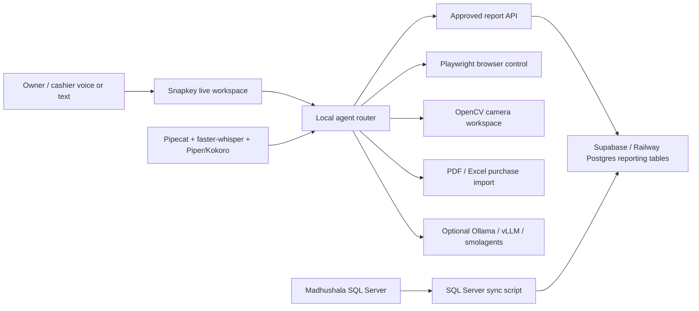

# Free Local Madhushala AI Agent Stack

This is the no-ElevenLabs architecture for Madhushala retail users. ElevenLabs can stay as a premium cloud voice option, but the core product should work locally or with very low-cost cloud hosting.

## What We Are Building

## Why This Is Better For Retail Clients

- No per-minute ElevenLabs bill for normal usage.
- Reports keep working from Supabase/Postgres even if the shop PC is off.
- The agent never runs arbitrary SQL from voice. It chooses approved report types, date windows, chart style, and row limits.
- Voice, charts, browser control, camera view, and purchase import are separate tools, so one failure does not break the whole assistant.

## Core Workspaces

1. **Report workspace**
   - Voice/text examples:
     - "Show yesterday sales"
     - "Top selling products this month"
     - "Supplier report last 30 days"
     - "Low stock items"
     - "Show account summary"
   - Backend source:
     - `report_sales_daily`
     - `report_product_sales_daily`
     - `report_inventory_current`
     - `report_purchase_daily`
     - `report_supplier_daily`
     - `report_account_daily`

2. **Browser workspace**
   - Free local option: Playwright.
   - Paid hosted option later: Browserbase.
   - Use cases:
     - Open Google, YouTube, vendor portals, excise sites, CRM pages.
     - Manual login/captcha handoff.
     - Voice-controlled search, play, pause, back, next.

3. **Camera workspace**
   - Free option: OpenCV reading local webcam, RTSP CCTV, or demo MP4.
   - Use cases:
     - "Show camera 1"
     - "Show worker monitoring"
     - "Show counter camera"
   - Later add detection models for person count, idle time, and activity labels.

4. **Purchase import workspace**
   - Start with PDF/Excel preview only.
   - Extract supplier, invoice date, item rows, quantity, rate, total.
   - Match extracted products with `itemmst`.
   - Require human confirmation before writing anything to Madhushala.

## Voice Stack

Recommended free path:

- STT: `faster-whisper`
- Realtime pipeline: `pipecat-ai`
- TTS: Piper, Kokoro, or Coqui XTTS depending on the machine
- LLM: Ollama locally, or vLLM on a GPU server
- Agent tools: FastAPI endpoints plus smolagents for planning

For tomorrow-level demos, text command plus browser microphone is enough. For production, run the local voice service as a Windows tray app or separate desktop EXE.

## Safe Reporting Rules

- The LLM is not allowed to generate raw SQL against the live database.
- It can select only approved report names.
- Backend enforces:
  - tenant ID from server-side config
  - max date window
  - max chart points
  - query timeout
  - read-only reporting tables

## Current Repo Pieces

- `app/services/local_agent.py` routes text/voice commands into report, browser, camera, and purchase workspaces.
- `app/api/local_agent.py` exposes `/api/local-agent/status` and `/api/local-agent/command`.
- `connector/create_madhushala_cloud_views.sql` creates SQL Server views from the real Madhushala tables.
- `connector/create_postgres_reporting_tables.sql` creates cloud reporting tables.
- `scripts/sync_sqlserver_to_postgres.py --cloud-only` syncs only the verified analytics tables.
- `docs/supabase-madhushala-reporting.md` explains Supabase/Railway setup.

## Next Implementation Order

1. Sync verified SQL Server views into Supabase/Postgres.
2. Confirm report workspace charts render from Postgres.
3. Add Pipecat voice loop locally.
4. Add Playwright browser command executor with confirmation gates.
5. Add OpenCV demo camera feed, then real RTSP camera support.
6. Add purchase PDF/Excel extraction preview.
