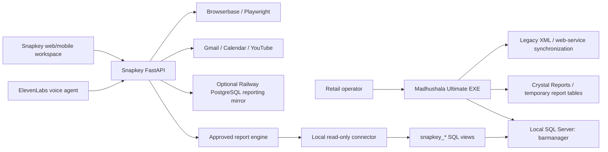
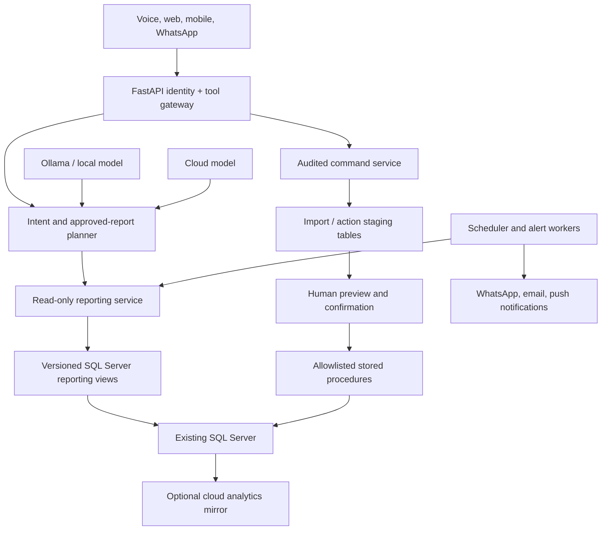
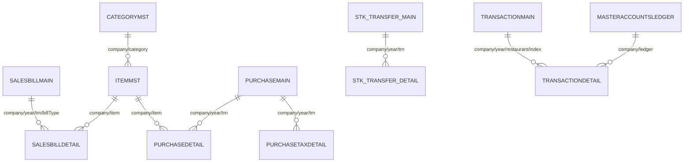

# Madhushala Ultimate AI Modernization Blueprint

## 1. Executive Summary

Madhushala Ultimate is a mature Windows desktop ERP for liquor retail operations. The decompiled application combines POS billing, purchase entry, inventory, stock transfer, breakage, accounting, reconciliation, synchronization, and Crystal Reports against a local SQL Server database.

The correct modernization strategy is **not** to replace the EXE. Keep SQL Server and the EXE as the operational system of record, then add a controlled intelligence layer around them:

1. Read-only reporting views expose stable business data.
2. FastAPI provides authenticated, tenant-scoped APIs.
3. An allowlisted query planner converts natural language into approved reports.
4. ElevenLabs provides voice interaction and invokes the same safe tools.
5. Scheduled workers generate alerts, summaries, forecasts, and reconciliations.
6. Future write automation uses staging, preview, approval, and audited stored procedures.
7. A local connector and local LLM keep essential functions available when internet access fails.

The repository already contains a strong starting point: FastAPI integrations, approved retail reports, SQL Server reporting views, local-to-cloud reporting sync, Google tools, Browserbase, YouTube, and the live voice workspace.

## 2. Analysis Scope And Evidence

The analysis is based on:

- Decompiled source in `madhusalaexe/Madhushala Ultimate`.
- Inspected SQL Server schema in `barmanager-schema.json`.
- Existing reporting views in `connector/create_reporting_views.sql`.
- Existing FastAPI integrations in `app/api/integrations.py`.
- Existing approved report engine in `app/services/retail_reports.py`.
- Existing local SQL Server connector and PostgreSQL sync scripts.

Important caveats:

- Decompiled source can contain duplicated or imperfectly reconstructed code.
- The database does not expose reliable foreign-key metadata in the inspected schema. Relationships below are inferred from joins and transaction code.
- SQL is heavily embedded in C# strings. The audit found **118 SQL-bearing C# files**. Large configuration and report forms also create or alter many stored procedures.
- Before enabling writes from the new layer, validate every affected legacy workflow against a disposable database copy.

## 3. Current System Architecture



### Recommended Target Architecture



The reporting and command paths must remain separate. Reporting can be broadly available with tenant controls. Any command that changes ERP data must require role checks, preview, confirmation, idempotency, and an audit record.

## 4. Core Database Model

`companycode` is the primary tenant boundary. Most transactional relationships also include `yearcode`, and often `trnno`, `billType`, `IndexId`, or `storecode`.

### Sales And Billing

| Table | Purpose | Important columns |
|---|---|---|
| `salesbillmain` | Bill header, payment split, customer, delivery and audit metadata | `companycode`, `yearcode`, `trnno`, `billType`, `trndate`, `trntime`, `ledgercode`, `salestype`, `storecode`, `amount`, `discamount`, `netamount`, `CashAmount`, `CardAmount`, `UPIAmount`, `PartyAmount`, `trnid` |
| `salesbilldetail` | Bill line items | `companycode`, `yearcode`, `trnno`, `billType`, `itemcode`, `qnty`, `rate`, `itemAmount`, discounts, tax, batch, MRP |
| `sales_tax` | Sales tax details where used | Bill-linked tax rows |
| `customerDetails` | Retail customer profile and visits | `companyCode`, `customerCode`, `customerName`, contacts, `visitCount`, `discountRate` |

Relationship:

```text
salesbillmain 1 --- N salesbilldetail
join: companycode + yearcode + trnno + billType

salesbilldetail N --- 1 itemmst
join: companycode + itemcode
```

### Purchases

| Table | Purpose | Important columns |
|---|---|---|
| `purchasemain` | Purchase/return header | `companycode`, `yearcode`, `trnno`, `ptype`, `suppliercode`, `shopcode`, invoice/pass fields, totals, `trnid`, `billType` |
| `purchasedetail` | Purchase lines and batch information | `companycode`, `yearcode`, `trnno`, `itemcode`, batch, quantity, free quantity, rates, MRP, discount, amount, expiry |
| `PurchaseTaxDetail` | Purchase tax and rounding ledger allocation | `companycode`, `yearcode`, `trnno`, scheme, tax code/rate/amount/account |

Relationship:

```text
purchasemain 1 --- N purchasedetail
join: companycode + yearcode + trnno

purchasemain 1 --- N PurchaseTaxDetail
join: companycode + yearcode + trnno
```

### Products And Inventory

| Table | Purpose |
|---|---|
| `itemmst` | Product master, category/group/KFL, pack size, barcode, rates, minimum quantity |
| `categorymst`, `groupmst`, `kflmst`, `strength` | Product classification |
| `itemratemst`, `itemrateinfo` | Product selling-rate configuration |
| `openingstockmst`, `openingStockDetail` | Opening stock by item, store, batch and financial year |
| `stk_transfer_main`, `stk_transfer_detail` | Inter-store stock transfers |
| `breakagemain`, `breakagedetail` | Breakage/wastage movements |
| `tbl_Stock` | Materialized/rebuilt stock summary used for fast reporting |

Stock is derived from opening stock, purchases, sales, transfers in/out, and breakage. The decompiled `cls_conn2` code rebuilds `tbl_Stock` from these movement sources and `opening_closing_stock(...)`.

### Accounting And Ledger

| Table | Purpose |
|---|---|
| `MasterAccountsGroups` | Accounting groups |
| `MasterAccountsLedger` | Accounting ledger master |
| `MasterAccountsOpening` | Opening ledger balances |
| `TransactionMain` | Voucher header: sale, purchase, journal, contra, payment, receipt |
| `TransactionDetail` | Double-entry debit/credit lines using `TrnEffect` |
| `TransactionMatch` | Matching/settlement links |
| `TransactionReconciliation` | Bank reconciliation state |
| `BillWiseOutstanding` | Outstanding bill-level balances |

Relationship:

```text
TransactionMain 1 --- N TransactionDetail
join: companycode + yearcode + restaurantCode + IndexId

TransactionDetail N --- 1 MasterAccountsLedger
join: companycode + TrnAccount = ledgerCode
```

`cls_journalEntry` confirms that sales, purchases, journals, contra, payments, and receipts use `TransactionMain` plus balanced `TransactionDetail` rows.

### Relationship Overview



## 5. Verified Workflow Breakdown

### Purchase Entry

1. Operator selects purchase or return, supplier, store, invoice details, tax scheme, and pass details.
2. Operator enters each item, batch, box/loose quantity, free quantity, MRP, rate, discount, and expiry.
3. Application validates return quantity and recalculates gross, tax, rounding, and net totals.
4. On edit, the existing purchase tax, detail, header, and accounting rows are removed/rebuilt.
5. `purchasemain` is inserted.
6. Each row is inserted into `purchasedetail`.
7. Stock is updated; purchase edits reconcile old and new quantities.
8. Changed MRP/selling rates can update `itemratemst` and `itemmst`.
9. Rounding and tax rows are inserted into `PurchaseTaxDetail`.
10. Corresponding accounting voucher rows are created in `TransactionMain` and `TransactionDetail`.
11. Sync metadata is marked for legacy synchronization.

Existing automation evidence: `frmImportfromPDF.cs` already performs a form of PDF purchase import, but it still writes directly and should be replaced or wrapped with a safer preview/approval pipeline.

### Sales / Billing

1. Operator scans/searches products and selects quantities, batches, rates, discounts, and payment mode.
2. Application validates stock and calculates gross, discount, taxes, round-off, and net amount.
3. Existing bill rows are removed/rebuilt during edits.
4. Each line is inserted into `salesbilldetail`.
5. Header and payment data are inserted into `salesbillmain`.
6. Batch-level purchased stock can be updated by increasing `saleqty` and decreasing `closing`.
7. Sale, return, and different bill types are handled separately.
8. A `SALE` voucher is created in `TransactionMain`, with balanced ledger entries in `TransactionDetail`.
9. Print/report/sync processes run afterward.

### Inventory And Stock Reconciliation

1. Opening stock originates from `openingstockmst` and `openingStockDetail`.
2. Purchases increase stock.
3. Sales decrease stock.
4. Stock transfers decrease the source store and increase the destination store.
5. Breakage decreases stock.
6. `opening_closing_stock(...)` and stock procedures aggregate movements.
7. `tbl_Stock` is rebuilt/materialized for operational reporting.
8. Operators compare physical counts with calculated closing stock and manually investigate differences.

### Accounting And Bank Reconciliation

1. Business transactions create a voucher header in `TransactionMain`.
2. Debit and credit rows are inserted into `TransactionDetail`.
3. `TrnEffect` determines debit/credit direction.
4. Ledger reports combine opening balances and transaction activity.
5. Bank reconciliation shows vouchers for a selected cash/bank ledger.
6. Operator manually inserts, updates, or deletes `TransactionReconciliation` entries and cheque/reconciliation dates.

### Reporting

1. User selects report, date range, company/year, store, category/group, or ledger filters.
2. Forms run embedded SQL, stored procedures, or populate temporary report tables.
3. Crystal Reports render the result.
4. Reports include sales dashboards, stock/opening-closing reports, group/category reports, day close, ledger summaries, purchase reports, and reconciliation.

## 6. SQL Inventory And Risks

The source contains 118 C# files with SQL-bearing strings. The highest-volume files are:

| File | Approximate SQL keyword hits | Role |
|---|---:|---|
| `frm_companyparameter1.cs` | 1,499 | Creates/alters schema, procedures, sync functions |
| `frm_main.cs` | 1,384 | Main application, synchronization, delete/replay logic |
| `frm_ReportForm.cs` | 1,052 | Reporting |
| `frm_companyparameter.cs` | 1,043 | Schema/procedure configuration |
| `frm_countersales_batch.cs` | 314 | Batch-aware sales |
| `frm_countersales.cs` | 249 | Sales/billing |
| `frmOrderManage.cs` | 189 | Orders and delivery |
| `frm_Form1.cs` | 178 | Transaction operations |
| `frmImportfromPDF.cs` | 158 | PDF purchase import |
| `frm_ReportsPreview.cs` | 143 | Report preview |
| `frm_stocktransfer.cs` | 129 | Stock transfer |
| `frm_purchase.cs` | 104 | Purchase entry |

### Query Families

- Master data: item, category, group, KFL, storage, ledger, customer, user rights.
- Transaction writes: sales, purchase, transfer, breakage, journal, payment, receipt, contra.
- Accounting: voucher numbering, ledger balance, outstanding and reconciliation.
- Stock calculation: opening/closing stock, movement unions, materialized `tbl_Stock`.
- Reporting: product/category/group sales, day close, purchase and stock reports.
- Synchronization: XML/table-valued upload/download procedures and `Sync` flags.
- Administration: create/alter tables, functions, views, and stored procedures.

### Major Technical Risks

1. Extensive SQL string concatenation creates injection and quoting risks.
2. Business transactions are spread across UI forms rather than one atomic domain service.
3. Edit workflows often delete and rebuild related rows.
4. Some stock and report data is derived/materialized and can become stale.
5. Voucher number and index generation uses `TOP 1 ... ORDER BY ... DESC`, which can race under concurrent writes.
6. Reporting procedures can create/drop shared tables, creating concurrency risk.
7. The EXE and new services could conflict if both write without a coordinated command boundary.

## 7. Automation Opportunities Ranked By ROI

Time estimates are practical starting estimates and should be validated with two or three store operators.

| Rank | Task | Current manual effort | Automation potential | Recommended solution |
|---:|---|---|---|---|
| 1 | Daily owner summary and report generation | 20-45 min/day | Very high, low risk | Scheduled sales, payment, stock, and anomaly summaries with voice/web/WhatsApp delivery |
| 2 | Purchase invoice entry | 10-30 min/invoice | Very high | Excel/PDF extraction, item matching, validation, preview, then approved import |
| 3 | Stock reconciliation | 1-4 hours/cycle | High | Mobile count sheet, variance analysis, movement explanation, approval-based adjustment |
| 4 | Ledger and outstanding lookup | 5-15 min/request | Very high | Conversational ledger summary and drill-down APIs |
| 5 | Bank/payment reconciliation | 30-120 min/day | High | Import bank/UPI settlement file, matching suggestions, exception queue |
| 6 | Low-stock and reorder planning | 30-60 min/day | High | Dynamic reorder recommendations using velocity, lead time, safety stock, and current stock |
| 7 | Sales anomaly/fraud review | Mostly reactive | High | Alerts for unusual discounts, voids, returns, after-hours activity, and payment mismatch |
| 8 | Compliance/excise report preparation | Hours per period | Medium-high | Scheduled validated report packs and missing-data checks |
| 9 | Product/rate maintenance | Repetitive and error-prone | Medium | Bulk preview/import with duplicate and margin checks |

### Purchase Automation Flow

```text
Upload invoice PDF/Excel
-> extract header and lines
-> normalize supplier/item names
-> match against itemmst and ledger masters
-> validate quantity, MRP, tax, totals, duplicate invoice
-> show confidence and unresolved fields
-> operator corrects and approves
-> create idempotent import job
-> execute allowlisted transaction procedure
-> verify stock/accounting totals
-> write audit log
```

No AI model should directly insert into purchase tables.

## 8. Modern AI Augmentation Plan

### Natural Language And Voice

Natural-language requests should resolve to a structured plan, never raw SQL:

```json
{
  "intent": "retail_report",
  "report_name": "top_products",
  "tenant_id": "resolved-from-user",
  "days": 7,
  "limit": 20,
  "chart": "bar"
}
```

Examples:

- “Show today’s sales” -> `sales_summary`, one day.
- “Which products are low in stock?” -> `low_stock`.
- “Top whisky products this month” -> approved top-products report plus category filter.
- “Why was yesterday lower?” -> compare periods and generate an evidence-backed explanation.

### Smart Reporting

Add deterministic insight calculations after report execution:

- Period-over-period sales and average-bill change.
- Product/category contribution.
- Payment mix changes.
- Slow-moving and dead stock.
- Unusual returns, voids, discounts, complimentary sales, or after-hours sales.
- Purchase-to-sales ratio and stock cover days.
- Gross-margin estimates when purchase-rate quality is sufficient.

### Alerts And Scheduled Work

- Low stock and projected stock-out alerts.
- Daily opening and closing summary.
- Sales drop/spike alerts.
- Large discount/return/void alerts.
- Unreconciled card/UPI settlement alerts.
- Purchase invoice duplicate alerts.
- Expiry and stale-batch alerts.
- Data freshness and connector health alerts.

### Offline-First Operation

Run the following locally on the store PC or local network:

- SQL Server read-only connector.
- FastAPI edge service for approved reports.
- Ollama or vLLM-compatible local model for intent classification and summaries.
- Local embeddings for manuals, SOPs, product catalog, and report definitions.
- Local job queue that stores pending notifications/actions.
- Cloud fallback only when internet is available.

The local model should select an approved tool and summarize tool output. It should not generate or execute arbitrary SQL.

## 9. Critical API Design

Use `/api/v1`, authenticated users, role-based access, tenant assignment from the server, request IDs, and audit logging. Do not accept `companycode` directly from an untrusted client.

### `GET /api/v1/sales/today`

Response:

```json
{
  "date": "2026-06-13",
  "total_sales": 128450.50,
  "bill_count": 342,
  "average_bill": 375.59,
  "payment_mix": [
    {"method": "Cash", "amount": 58420.00},
    {"method": "UPI", "amount": 51200.50}
  ],
  "freshness": "2026-06-13T20:10:03+05:30"
}
```

SQL logic:

```sql
SELECT SUM(netamount), COUNT(*), AVG(netamount)
FROM salesbillmain
WHERE companycode = @tenant
  AND trndate >= @start
  AND trndate < @end;
```

Use the `snapkey_bills` and `snapkey_payments` views in production.

### `GET /api/v1/stock`

Query parameters: `search`, `category`, `low_only`, `limit`, `cursor`.

Response:

```json
{
  "items": [
    {
      "item_code": "I00123",
      "name": "Example Product",
      "category": "WHISKY",
      "stock": 8,
      "reorder_level": 12,
      "status": "low"
    }
  ],
  "next_cursor": null
}
```

SQL logic: select from a versioned inventory view joining `tbl_Stock`, `itemmst`, and `categorymst`, tenant-filtered and paginated.

### `GET /api/v1/ledger/{ledger_code}`

Query parameters: `from`, `to`, `limit`, `cursor`.

Response:

```json
{
  "ledger_code": "L00042",
  "ledger_name": "Example Supplier",
  "opening_balance": 4500.00,
  "debits": 22000.00,
  "credits": 18000.00,
  "closing_balance": 8500.00,
  "entries": []
}
```

SQL logic: reproduce the validated `LedgerBalanceNew` logic through a read-only, parameterized procedure/view. Join `TransactionMain`, `TransactionDetail`, `MasterAccountsLedger`, and opening balances.

### `GET /api/v1/alerts`

Response:

```json
{
  "alerts": [
    {
      "id": "alert_123",
      "type": "low_stock",
      "severity": "high",
      "title": "12 products below reorder level",
      "created_at": "2026-06-13T20:00:00+05:30",
      "evidence": {"report": "low_stock"}
    }
  ]
}
```

Alerts should be persisted with status, assignee, acknowledgement, evidence, and resolution.

### `POST /api/v1/query/plan`

Request:

```json
{"question": "Show top selling products for the last 30 days as a bar chart"}
```

Response:

```json
{
  "plan_id": "plan_123",
  "report_name": "top_products",
  "days": 30,
  "limit": 20,
  "chart": "bar",
  "requires_confirmation": false
}
```

### `POST /api/v1/query/execute`

Request:

```json
{"plan_id": "plan_123"}
```

Response:

```json
{
  "title": "Top-selling products",
  "chart": "bar",
  "rows": [{"label": "Product A", "value": 480}],
  "insights": ["Product A contributed 18% of unit sales."],
  "limits_applied": {"days": 30, "points": 20}
}
```

The server resolves the plan to an allowlisted parameterized query. No SQL appears in the client request.

### `POST /api/v1/purchases/import/preview`

Multipart request: invoice PDF, image, or Excel.

Response:

```json
{
  "job_id": "import_123",
  "supplier_match": {"ledger_code": "L00042", "confidence": 0.97},
  "invoice_number": "INV-8842",
  "totals": {"gross": 18000, "tax": 3240, "net": 21240},
  "lines": [
    {
      "source_name": "Example 750 ML",
      "matched_item_code": "I00123",
      "confidence": 0.93,
      "quantity": 24,
      "mrp": 950,
      "warnings": []
    }
  ],
  "can_commit": true
}
```

### `POST /api/v1/purchases/import/{job_id}/commit`

Request:

```json
{"confirmation_token": "short-lived-token", "idempotency_key": "invoice-supplier-8842"}
```

Implementation:

1. Revalidate job and duplicate invoice.
2. Lock/import using a controlled stored procedure.
3. Insert header, detail, tax, stock effects, and accounting voucher atomically.
4. Roll back on any mismatch.
5. Verify debits equal credits and stock effects match lines.
6. Store before/after audit evidence.

### Additional Recommended Endpoints

| Endpoint | Purpose |
|---|---|
| `GET /api/v1/reports/catalog` | Approved report definitions |
| `POST /api/v1/reports/run` | Execute approved parameterized report |
| `GET /api/v1/purchases/trend` | Purchase trend |
| `GET /api/v1/reorders/recommendations` | Reorder plan |
| `POST /api/v1/stock/counts` | Upload physical counts |
| `GET /api/v1/stock/counts/{id}/variance` | Explain variance |
| `POST /api/v1/reconciliation/import` | Import settlement/bank statement |
| `GET /api/v1/reconciliation/exceptions` | Suggested unmatched entries |
| `POST /api/v1/actions/{id}/confirm` | Confirm a staged write action |

## 10. Competitive Features

### AI Assistant Dashboard

- Voice-first owner briefing.
- Live charts selected by conversation.
- Drill-down from summary to bill, item, store, or ledger evidence.
- Suggested next questions and one-tap actions.

### Predictive Stock Planning

For each item/store calculate:

```text
daily_velocity = recent_units_sold / selling_days
lead_time_demand = daily_velocity * supplier_lead_time_days
safety_stock = demand_variability * service_factor
recommended_order = max(0, lead_time_demand + safety_stock - current_stock - open_purchase_qty)
```

Add seasonality, day-of-week patterns, holidays, and supplier reliability later.

### Fraud And Anomaly Detection

- Unusual discount by user/counter.
- Returns without corresponding recent sale.
- Voids/deletions after closing.
- High complimentary sales.
- Stock movement without expected sales/purchase.
- Payment mix mismatch against bank/UPI settlement.
- Repeated edits to the same bill.

Start with rules and statistical thresholds. Use ML only after collecting labelled outcomes.

### Camera Integration

Optional and privacy-sensitive:

- Show approved camera streams in the assistant workspace.
- Detect queue length, occupancy, restricted-area entry, and after-hours movement.
- Do not use face recognition or employee productivity scoring without explicit legal, policy, and employee-review processes.
- Keep camera events separate from ERP write actions.

### Browser Automation

Useful for portals without APIs:

- Download supplier invoices or settlement reports.
- Open excise/compliance portals and prepare forms.
- Compare distributor catalog prices.
- Present a live browser for manual CAPTCHA/login completion.

Require manual confirmation before submission, payment, purchase, or sending.

### WhatsApp And Notifications

- Daily owner summary.
- Low-stock approval cards.
- Sales anomaly alerts.
- Purchase import review link.
- Payment reconciliation exceptions.

Use templates, tenant-specific recipients, quiet hours, escalation rules, and delivery logs.

## 11. Practical Implementation Roadmap

### Phase 1: Quick Wins, 1-2 Days

1. Keep existing `snapkey_*` views and report allowlist.
2. Add `/api/v1/sales/today`, `/stock`, `/ledger/{code}`, `/alerts`, and query plan/execute endpoints.
3. Add three high-value views: ledger summary, stock movement, and sales anomaly evidence.
4. Add data freshness and connector health to every report response.
5. Connect ElevenLabs tools only to the allowlisted API.
6. Add scheduled daily owner summary and low-stock alerts.

Acceptance criteria:

- No arbitrary SQL.
- Tenant isolation tests.
- Report timeout and point limits.
- Mobile dashboard and voice both render the same report payload.

### Phase 2: Automation, 3-5 Days

1. Build purchase import preview for Excel and PDF.
2. Add item/supplier matching with confidence and correction UI.
3. Add duplicate invoice, tax-total, and line-total validation.
4. Add physical stock count upload and variance report.
5. Add alert persistence, acknowledgement, and WhatsApp/email delivery.
6. Prototype bank/UPI reconciliation import and matching.

Do not enable purchase commit until a disposable-database test proves stock and accounting parity with the EXE.

### Phase 3: AI Intelligence, 1-2 Weeks

1. Add conversational report planner with structured output.
2. Add deterministic insight engine and period comparisons.
3. Add reorder recommendations and stock-out prediction.
4. Add anomaly rules and operator feedback.
5. Add local Ollama/vLLM fallback and offline queue.
6. Add full audit trail, observability, and role-based permissions.

### Phase 4: Advanced Product

1. Approved command service for purchase commit and reconciliation updates.
2. Multi-store benchmarking and owner portfolio dashboard.
3. Supplier performance and price intelligence.
4. Customer segmentation and campaign recommendations.
5. Camera events and browser-assisted compliance workflows.
6. Continuous model/tool evaluation using real anonymized requests.

## 12. Production Guardrails

- Treat the EXE and SQL Server as the source of truth.
- Use a dedicated read-only SQL login for reports.
- Never expose SQL Server directly to the public internet.
- Derive tenant/company assignment from authenticated server-side identity.
- Parameterize every query and keep report names allowlisted.
- Apply query timeout, maximum date range, pagination, and result-size limits.
- Separate read credentials from command credentials.
- Require preview and explicit confirmation for every write.
- Use idempotency keys for imports and actions.
- Record actor, request, approval, SQL procedure, before/after evidence, and result.
- Verify balanced accounting entries and expected stock changes after writes.
- Back up and test restore before enabling any automated write.
- Add connector freshness, API latency, error rate, and failed-job monitoring.

## 13. Immediate Engineering Backlog

1. Create versioned views: `snapkey_ledger_entries`, `snapkey_stock_movements`, `snapkey_sales_anomalies`, and `snapkey_supplier_purchases`.
2. Extend `app/services/retail_reports.py` with ledger, margin, returns, discounts, and stock-cover reports.
3. Add a structured query planner endpoint that maps speech/text to approved report definitions.
4. Add `report_freshness` and source (`local_connector` or `cloud_mirror`) to report payloads.
5. Add scheduled daily summary and low-stock jobs.
6. Build purchase-import staging tables and preview API without commit.
7. Add tenant-isolation, timeout, large-table, and stale-data tests.
8. Validate all future write procedures against a restored copy of `barmanager`.

This sequence produces immediate owner-facing value while preserving the reliability of the legacy ERP.
